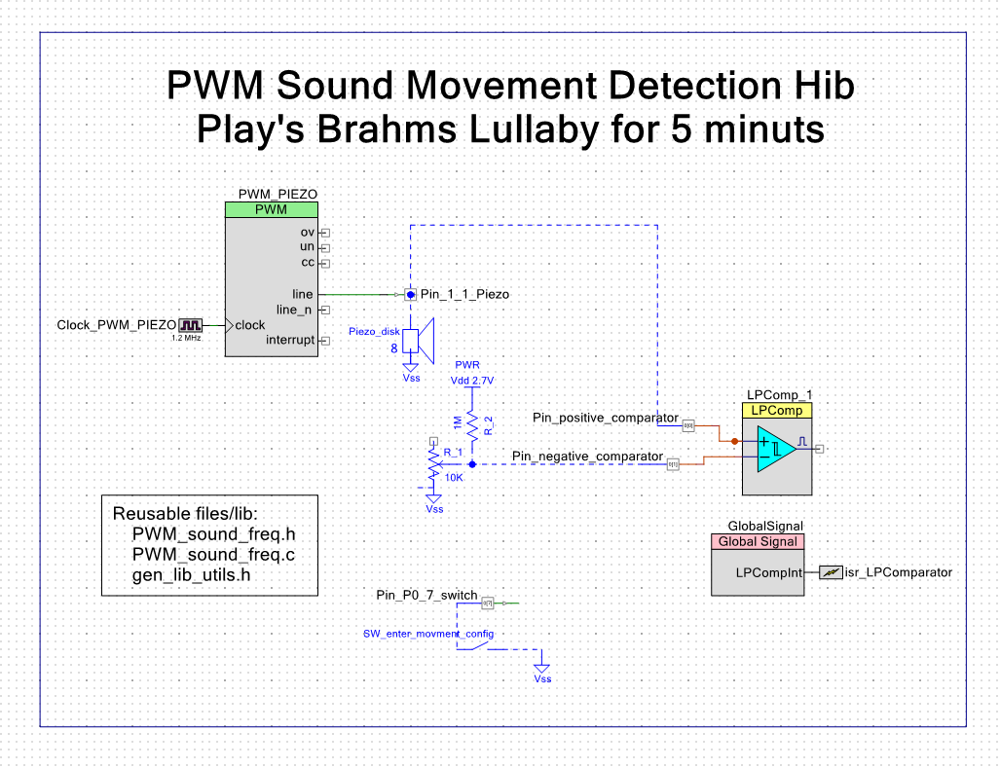

# Cypress PSoC 4 Lullaby Music Box With Piezo Movement Detection
A simple Brahms Lullaby music box that plays the tune and then hibernates until a gentle movement arrives and start playing again.

# Description
I designed and made this small Brahms Lullaby music box for my small daughter. It uses the Cypress PSoC 4 micro-controllers in a small kit board. It is a ARM Cortex M0 at 48MHz with 32 bits. The coolest technical feature of this small project is the fact that it uses the piezo disc both to play the Lullaby and to sense the most gentle vibration while in hibernation. This will awake it and play the Lullaby again.     

# Peripherals configuration and schematic
  

# How it all works
You turn ON the power button and it starts to play for 5 minutes the Brahms Lullaby, then it enters in hibernation. After that, if it detects any vibration (movement of a person), it will wake up from hibernation and plays for another 5 minutes and this cycle repeats each time there is movement. The threshold of the vibration, small voltage produced by the piezo, is can be set by a potentiometer.    
To enter in the configuration mode, one only as to press te switch that is on the dev board 049-kit (PSoC 4) and then after detecting a vibration / movement it play a sound for half a second and hibernates. It stays waiting for the next vibration. In this way you can easily set the potentiometer adjusting the sensibility that you want, this box in this moment detects gentle vibration from the other side of an 1.6 meter table. I think that it come out nice and my daughter liked it.  
The original idea was that my daughter before she goes to sleep, she would nock gently on the small bed side table and it would play the Lullaby for 5 minutes, then if see didn't sleep she would knock again gently and it would play again for another 5 minutes.   
Other then the switch, it has an potentiometer of 10K and a resistor of 1MOhm and the piezo, it allows to adjust the sensibility of the detector of vibrations / movements and plays the sounds. 

# Low power energy consumption
* 3.8mAh current/hour consumption while playing the music.
* 4.5uAh total current/hour consumption of the project in hibernation.
* 2.7uAh current/hour of the drop in voltage in the voltage divider resistors.
* 1.8uAh current/hour consumption of the micro-controller, including the low power comparator.

Two 1.5V batteries of 1800mAh should last for 400 000 hours in hibernation. That is 16 666 days, or 45 years. It's clear, that batteries don't last that long, because in the first years they would discharge. But in the context of lithium batteries there are some that last for 10 year. With them, it would make sense to design and talk about those ultra low power modes. A real victory for something that cost's only 4 dollars each dev board!  

# Development board used
[Cypress PSoC 4 CY8CKIT-049 4xxx Prototyping Kits](https://www.cypress.com/documentation/development-kitsboards/psoc-4-cy8ckit-049-4xxx-prototyping-kits)

# To learn more about Electronics and micro-controllers....
Go to my github page [How to learn modern electronics](https://github.com/joaocarvalhoopen/How_to_learn_modern_electronics)

# License
MIT Open Source license.

# Have fun!
Best regards,  
Joao Nuno Carvalho  